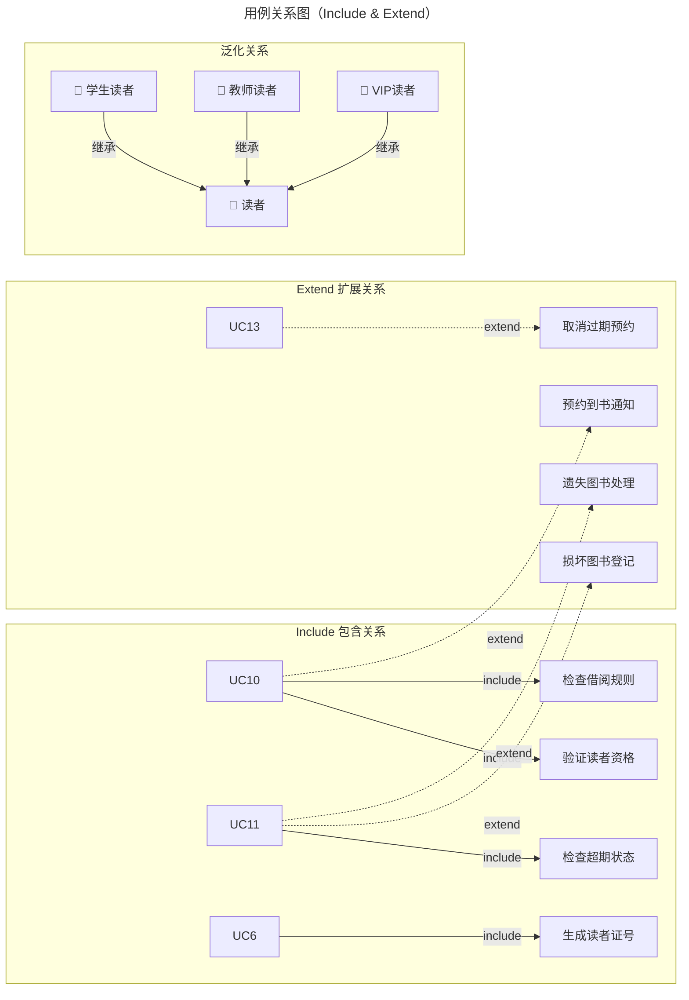

# 图书管理系统 用例图

## 一、系统整体用例图（Mermaid）

```mermaid
---
title: 图书管理系统 Use Case Diagram
---
flowchart LR
    %% ========== 参与者 ==========
    subgraph actors[" "]
        direction TB
        Admin["👤 系统管理员"]
        Librarian["👤 图书馆员"]
        Reader["👤 读者"]
        Manager["👤 馆长/管理层"]
    end

    %% ========== 系统边界 ==========
    subgraph system["图书管理系统"]
        direction TB

        %% ---- 图书管理模块 ----
        subgraph bm["图书管理"]
            UC1["📚 图书编目入库"]
            UC2["📖 查询图书"]
            UC3["✏️ 修改图书信息"]
            UC4["🗑️ 图书下架/注销"]
            UC5["❌ 图书遗失登记"]
        end

        %% ---- 读者管理模块 ----
        subgraph rm["读者管理"]
            UC6["📝 读者注册"]
            UC7["🔍 查询读者信息"]
            UC8["📇 读者证挂失/解挂"]
            UC9["🚫 读者证注销/冻结"]
        end

        %% ---- 流通管理模块 ----
        subgraph cm["借阅流通"]
            UC10["📖 借书"]
            UC11["📚 还书"]
            UC12["🔄 续借"]
            UC13["📅 预约图书"]
            UC14["❌ 取消预约"]
        end

        %% ---- 馆藏管理模块 ----
        subgraph im["馆藏管理"]
            UC15["📊 馆藏统计"]
            UC16["🔎 馆藏盘点"]
        end

        %% ---- 超期与违约金 ----
        subgraph am["超期与违约金"]
            UC17["🔔 接收超期提醒"]
            UC18["💰 缴纳违约金"]
        end

        %% ---- 统计分析 ----
        subgraph stats["统计分析"]
            UC19["📈 流通统计"]
            UC20["👥 读者统计"]
            UC21["📋 生成报表"]
            UC22["📥 导出报表"]
        end

        %% ---- 系统管理 ----
        subgraph sm["系统管理"]
            UC23["👥 用户管理"]
            UC24["🔐 权限配置"]
            UC25["⚙️ 参数配置"]
            UC26["💾 数据备份"]
            UC27["📜 操作日志查询"]
        end
    end

    %% ========== 参与者-用例关系 ==========
    %% 系统管理员
    Admin --> UC1
    Admin --> UC3
    Admin --> UC4
    Admin --> UC5
    Admin --> UC6
    Admin --> UC23
    Admin --> UC24
    Admin --> UC25
    Admin --> UC26
    Admin --> UC27

    %% 图书馆员
    Librarian --> UC1
    Librarian --> UC2
    Librarian --> UC3
    Librarian --> UC4
    Librarian --> UC5
    Librarian --> UC6
    Librarian --> UC7
    Librarian --> UC8
    Librarian --> UC9
    Librarian --> UC10
    Librarian --> UC11
    Librarian --> UC12
    Librarian --> UC15
    Librarian --> UC16
    Librarian --> UC18
    Librarian --> UC19
    Librarian --> UC20
    Librarian --> UC21
    Librarian --> UC22
    Librarian --> UC27

    %% 读者
    Reader --> UC2
    Reader --> UC7
    Reader --> UC10
    Reader --> UC11
    Reader --> UC12
    Reader --> UC13
    Reader --> UC14
    Reader --> UC17
    Reader --> UC18

    %% 馆长/管理层
    Manager --> UC15
    Manager --> UC19
    Manager --> UC20
    Manager --> UC21
    Manager --> UC22
    Manager --> UC27
```

---

## 二、用例规约摘要

### UC1：图书编目入库

| 项目 | 内容 |
|------|------|
| **用例ID** | UC1 |
| **用例名称** | 图书编目入库 |
| **参与者** | 系统管理员、图书馆员 |
| **前置条件** | 操作员已登录系统 |
| **后置条件** | 图书信息入库，馆藏数量更新 |
| **基本流程** | 1. 扫描/输入ISBN → 2. 录入/确认图书信息 → 3. 确认馆藏数量与位置 → 4. 保存入库 |
| **异常流程** | ISBN已存在 → 提示重复，是否更新现有记录 |

### UC2：查询图书

| 项目 | 内容 |
|------|------|
| **用例ID** | UC2 |
| **用例名称** | 查询图书 |
| **参与者** | 图书馆员、读者 |
| **前置条件** | 读者已登录（或游客查询） |
| **基本流程** | 1. 输入检索条件 → 2. 选择筛选条件 → 3. 查看结果列表 → 4. 查看图书详情 |
| **查询条件** | 书名、作者、ISBN、分类、出版社、出版年 |

### UC6：读者注册

| 项目 | 内容 |
|------|------|
| **用例ID** | UC6 |
| **用例名称** | 读者注册 |
| **参与者** | 系统管理员、图书馆员 |
| **前置条件** | 操作员已登录系统 |
| **后置条件** | 创建读者账户，生成读者证号 |
| **基本流程** | 1. 录入读者信息 → 2. 选择读者类型 → 3. 收取押金 → 4. 生成读者证 → 5. 打印凭证 |

### UC10：借书

| 项目 | 内容 |
|------|------|
| **用例ID** | UC10 |
| **用例名称** | 借书 |
| **参与者** | 图书馆员、读者（通过自助机） |
| **前置条件** | 读者证有效、无欠款、未超借阅数量 |
| **后置条件** | 借阅记录生成，馆藏状态更新，应还日期计算 |
| **基本流程** | 1. 扫描读者证 → 2. 验证读者资格 → 3. 扫描图书 → 4. 确认借阅 → 5. 打印凭证 |
| **业务规则** | 超出数量限制则拒绝；检查超期未还图书 |

### UC11：还书

| 项目 | 内容 |
|------|------|
| **用例ID** | UC11 |
| **用例名称** | 还书 |
| **参与者** | 图书馆员、读者（通过自助机） |
| **前置条件** | 图书处于借出状态 |
| **后置条件** | 借阅记录关闭，违约金计算（如有） |
| **基本流程** | 1. 扫描图书 → 2. 核对借阅信息 → 3. 检查超期 → 4. 计算违约金 → 5. 打印凭证 |
| **异常流程** | 超期 → 提示违约金金额 → 引导缴纳 |

### UC12：续借

| 项目 | 内容 |
|------|------|
| **用例ID** | UC12 |
| **用例名称** | 续借 |
| **参与者** | 图书馆员、读者（自助） |
| **前置条件** | 图书未超期，续借次数未用尽 |
| **后置条件** | 借阅到期日顺延 |
| **基本流程** | 1. 验证读者身份 → 2. 选择待续借图书 → 3. 确认续借 → 4. 更新到期日 |

### UC13：预约图书

| 项目 | 内容 |
|------|------|
| **用例ID** | UC13 |
| **用例名称** | 预约图书 |
| **参与者** | 读者 |
| **前置条件** | 图书已被借出 |
| **后置条件** | 预约队列添加记录 |
| **基本流程** | 1. 查询图书 → 2. 点击预约 → 3. 确认预约 → 4. 收到预约成功通知 |
| **异常流程** | 图书在馆 → 提示可直接借阅；已达预约上限 → 拒绝 |

### UC18：缴纳违约金

| 项目 | 内容 |
|------|------|
| **用例ID** | UC18 |
| **用例名称** | 缴纳违约金 |
| **参与者** | 图书馆员、读者 |
| **前置条件** | 读者存在未缴违约金 |
| **后置条件** | 违约金结清，读者状态恢复 |
| **基本流程** | 1. 查询读者欠款 → 2. 确认金额 → 3. 收取费用 → 4. 开具凭证 → 5. 更新状态 |

### UC19：流通统计

| 项目 | 内容 |
|------|------|
| **用例ID** | UC19 |
| **用例名称** | 流通统计 |
| **参与者** | 图书馆员、馆长/管理层 |
| **前置条件** | 操作员有统计权限 |
| **基本流程** | 1. 选择统计维度 → 2. 选择时间范围 → 3. 生成统计图表 |

### UC23：用户管理

| 项目 | 内容 |
|------|------|
| **用例ID** | UC23 |
| **用例名称** | 用户管理 |
| **参与者** | 系统管理员 |
| **前置条件** | 以管理员身份登录 |
| **基本流程** | 1. 新增/编辑/删除系统用户 → 2. 分配角色 → 3. 重置密码 |

---

## 三、参与者-用例矩阵

| 用例 | 系统管理员 | 图书馆员 | 读者 | 馆长/管理层 |
|------|:---------:|:--------:|:---:|:----------:|
| UC1 图书编目入库 | ✅ | ✅ | | |
| UC2 查询图书 | | ✅ | ✅ | |
| UC3 修改图书信息 | ✅ | ✅ | | |
| UC4 图书下架/注销 | ✅ | | | |
| UC5 图书遗失登记 | ✅ | ✅ | | |
| UC6 读者注册 | ✅ | ✅ | | |
| UC7 查询读者信息 | | ✅ | ✅ | |
| UC8 读者证挂失/解挂 | | ✅ | | |
| UC9 读者证注销/冻结 | | ✅ | | |
| UC10 借书 | | ✅ | ✅ | |
| UC11 还书 | | ✅ | ✅ | |
| UC12 续借 | | ✅ | ✅ | |
| UC13 预约图书 | | | ✅ | |
| UC14 取消预约 | | | ✅ | |
| UC15 馆藏统计 | | ✅ | | ✅ |
| UC16 馆藏盘点 | | ✅ | | |
| UC17 接收超期提醒 | | | ✅ | |
| UC18 缴纳违约金 | | ✅ | ✅ | |
| UC19 流通统计 | | ✅ | | ✅ |
| UC20 读者统计 | | ✅ | | ✅ |
| UC21 生成报表 | | ✅ | | ✅ |
| UC22 导出报表 | | ✅ | | ✅ |
| UC23 用户管理 | ✅ | | | |
| UC24 权限配置 | ✅ | | | |
| UC25 参数配置 | ✅ | | | |
| UC26 数据备份 | ✅ | | | |
| UC27 操作日志查询 | ✅ | ✅ | | ✅ |

---

## 四、用例关系图

